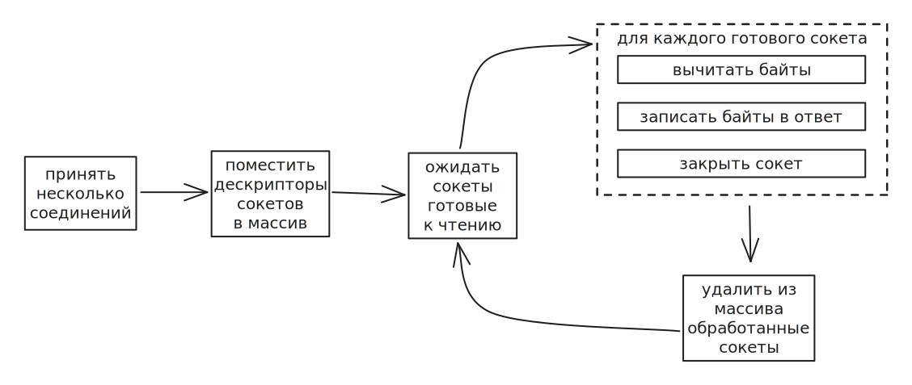
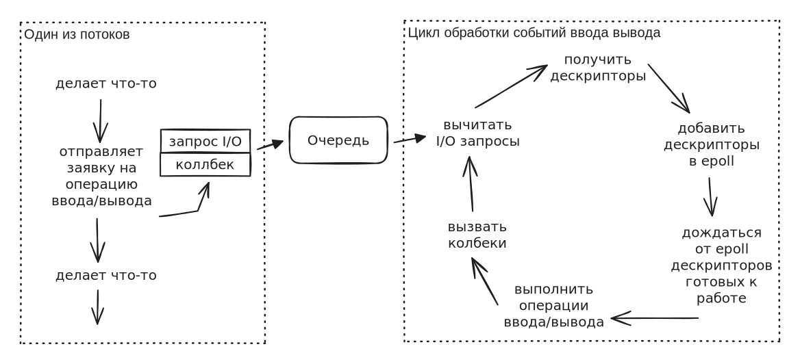
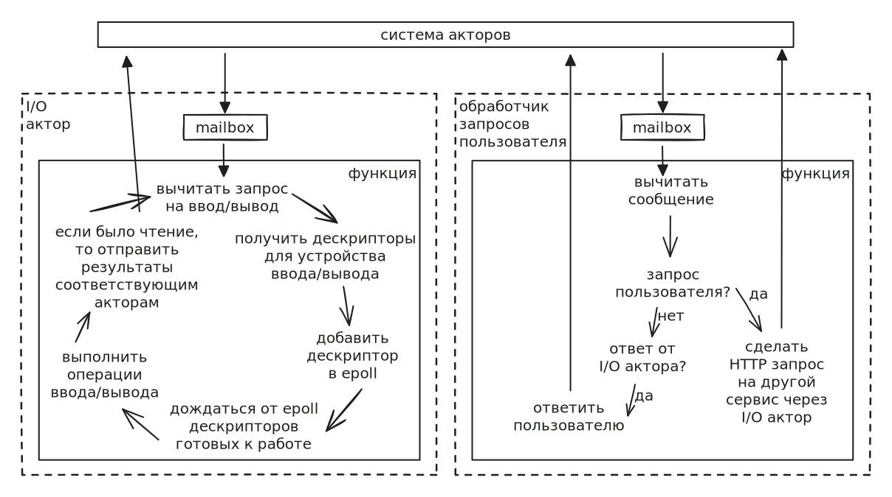
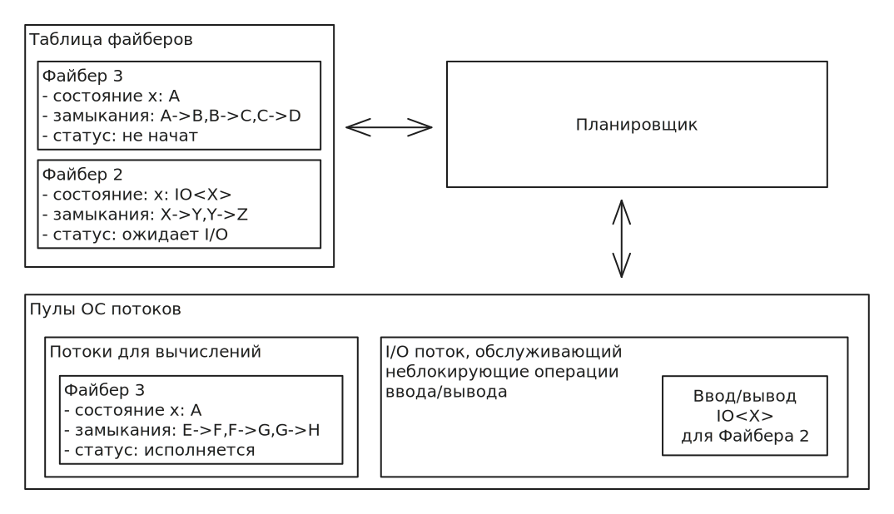

# Потоки и ввод/вывод

## Конкурентность и параллелизм

Перед тем как погружаться в тему асинхронности в Rust, нам надо немного остановится на терминологии. В английском языке есть два понятия: parallelism и concurrency.

**Parallelism** однозначно переводится на русский язык как "параллелизм", и в контексте программирования, означает одновременное выполнение кода на разных процессорах, или разных ядрах одного процессора.

С **concurrency** дела обстоят сложнее. Наиболее близкий аналог этого понятия в русском языке — "конкурентность". Когда говорят, что код — конкурентный, то имееют ввиду, что код написан таким образом, что он расчитан на параллельное исполнение.

Например, если мы запустим многопоточную программу на процессоре, у которого есть только одно ядро, то все потоки будут выпоняться по очереди, и реального параллелизма не будет. Однако при этом всё равно возможны все те проблемы, которые могут случиться при настоящем параллельном исполнении. Например, гонка за данные (data race) возможна даже при исполнении на одноядерном процессоре.

Можно сказать, что когда мы говорим о конкурентности, то речь идёт о логическом уровне параллельного исполнения, а когда мы говорим о параллелизме, подразумеваем физический уровень.

Асинхронные рантаймы, о которых пойдёт речь в этой главе, исполняют код конкурентно, но не обязательно паралельно. При этом, как мы уже сказали, требования к коду выдвигаются такие, словно он исполняется параллельно на физическом уровне.

## Проблемы потоков

Как мы знаем, бекенд приложения обслуживают множество запросов. Чтобы приложение работало отзывчиво, необходимо, чтобы поступающие запросы обрабатывались параллельно, а не ожидали обработки друг друга. Самый простой способ достичь этого — обрабатывать каждый запрос в отдельном потоке. Однако большое количество запущенных потоков в совокупности с болишим количеством операций ввода/вывода (а в бекенд приложениях, как правило, много ввода/вывода) могут стать серьезной проблемой для производительности приложения.

Дело в том, что ОС потоки являются дорогостоящим ресурсом:

* создание нового потока осуществляется системным вызовом, а это долго
* переключение между ОС потоками — длительная и дорогостоящая операция

><details>
> 
> <summary>Почему системный вызов — это долго?</summary>
>
> Системные вызовы (system call) — механизм при помощи которого программа работающая в пользовательском пространстве (user space) может вызывать функциональность из ядра операционной системы.
> 
> Системные вызовы работают немного по-разному в развисимости от операционной системы и архитектуры процессора, но общий принцип везде одинаковый.
> 
> Например, для операционной системы Linux и архитектуры x86-64, системный вызов, который создаёт новый поток, состоит из следующих шагов:
> 
> 1. Программа записывает номер желаемого системного вызова в регистр RAX\
>    (все доступные системные вызовы вместе с их номерами и описанием аргументов можно найти в документации Linux)
> 2. Аргументы системного вызова передаются в соответствии с их порядком через регистры RDI, RSI, RDX, R10, R8 и R9.
> 3. Адрес возврата из системного вызова помещается в регистр RCX.
> 4. Далее программа вызывает инструкцию `syscall`, которая стартует системный вызов. В 32-разрядном поколении Linux для старта системного вызова использовалось прерывание с номером 60. Оно работает и сейчас, однаком использование инструкции `syscall` предпочтительнее.
> 5. После вызова `syscall`, поток "засыпает", и происходит переключение в режим ядра. В режиме ядра процессор имеет доступ к памяти ядра и может обращаться к оборудованию. Для запуска нового потока, в ядре в таблице потоков будет создана новая запись, а так же будет выделено место для стека нового потока.
> 6. После того как работа в режиме ядра закончена, процессор (ядро процессора) переключается в пользовательский режим, и продолжает исполнение ранее уснувшего потока.
> 
> Все эти операции переключения контекста между пользовательским пространством и ядром весьма затратны по времени, и могут негативно сказаться на производительности программы.
>
> </details>

> <details>
> 
> <summary>Почему переключение между потоками — это долго?</summary>
> 
> Исполнением потоков на ядрах процессора заведует планировщик — подпрограмма в ядре операционной системы. Планировщик решает в какой последовательности, и как долго потоки будут исполняться на ядрах процессора.
> 
> После того как поток исчерпал свой квант времени (отпущенное для исполнения время) он прерывается, а его состояние (значение регистров) записывается в стек потока. В таблице потоков в ядре обновляется запись о состоянии остановленного потока. Далее, для следующего в очереди на исполнение потока восстанавливается его состояние из стека, и этот поток начинает исполнятся.
> 
> Все эта последовательность происходит далеко не мгновенно, а занимает немало процессорного времени: примерно одна микросекунда на современном процессоре и операционной системе Linux.
> 
> Таким образом, если у нас 10 потоков, и каждый из них в течении одной секунды должен хотя бы раз получить свой квант времени, то процессор потратит 10 микросекунд на переключения контекстов между потоками, и 999990 микросекунд на исполнение потоков. То есть 0.001% всего процессорного времени будет потрачено на перекллючения.\
Однако если у нас будет 10000 потоков, то процессор уже потратит 10000 микросекунд только на переключения, и 990000 микросекунд на исполнение. А это значит, что уже 1% всего процессорного времени было потрачего только на одни лишь переключения.\
Ситуация омрачается тем, что процессор старается, чтобы каждый поток получал квант времени чаще, чем один раз в секунду, а это значит, что переключий может быть (и будет) гораздо больше.
> 
> </details>

Таким образом, если у нас в программе мало потоков, которые занимаются, в основном, вычислениями, то нам вполне подойдут ОС потоки. Однако если у нас очень много потоков, и много операций ввода/вывода, то существенная доля всего времени работы процессора будет уходить просто на переключение между этими потоками. Очевидно, что удар по производительности будет существенный.

## Блокирующий и неблокирующий ввод/вывод

Бекенд приложения, как правило, являются приложениями с большим количеством операций ввода/вывода: работа с HTTP соединениями, работа с файловой системой, работа с БД, внешними очередями, распределёнными кешами и т.д. С точки зрения работы с потоками, существует два типа операций ввода/вывода: блокирующие и неблокирующие.

Блокирующие операции ввода/вывода работают следующим образом:

1. Поток делает системный вызов, запрашивающий блокирующую операцию ввода/вывода (например, чтение байт из открытого сетевого соединения).
2. После этого поток "засыпает", и отмечается в таблице потоков как ожидающий пробуждения после выполнения операции ввода/вывода.
3. В какой-то момент ядро осуществляет непосредственное чтение данных из устройства, и помещает их в буфер для чтения программой.
4. В таблице потоков обновляется запись для потока, ожидавшего эту операцию чтения. Теперь поток готов к продолжению своей работы.
5. Планировщик выдаёт квант времени потоку, когда наступит его очередь.
6. Поток пробуждается и читает данные, уже находящиеся в буфере.

Блокирующие операции ввода/вывода удобны в использовании, однако при написании бекенд приложений, обслуживающих большое количество одновременных запросов, использование блокирующих операций ввода/вывода приводит к множественным переключениям между потоками, что сильно бьёт по производительности.

Работа с неблокирующим вводом/выводом осуществляется немного по-другому. Для начала надо заметить, что неблокирующий API практически бесполезен для работы с одним устройством ввода/вывода, например, только одним сетевым сокетом.\
(Имеется ввиду не обязательно физическое устройство: например, на одной сетевой карте, сетевых сокетов может быть открыто несколько десятков тысяч).

Итак рассмотрим в общих чертах как происходит работа с неблокирующим вводом/выводом на примере epoll. epoll — это API для работы с неблокирующим вводом/выводом в операционной системе Linux. В зависимости от того с какой операционной системой мы работаем неблокирующее API буде разным: для Linux это может быть select, poll, epoll, io_uring, для Windows — IOCP, для BSD/MacOS — kqueue, и т.д.

Допустим, мы делаем "эхо" сервер, который принимает сетевое соединие, считывает из него байты и отправляет эти же байты обратно.

1. Мы получаем несколько соединений от клиентов, и каждое из соединений представлено сетевым сокетом. Вместо того, чтобы для каждого сокета сразу читать входные данные, мы просто берём дескрипторы этих сокетов и складываем их в массив.
2. Все дескрипторы одним массивом передаём в соответствующий системный вызов (epoll_wait) с указанием того, какие события мы ожидаем для этих сокетов. В нашем случае, это будет событие означающее, что данные из сокета готовы к прочтению.
3. Системный вызов epoll_wait блокирует вызвавщий его поток, а по пробуждении возвращает список дескрипторов, для которых данные готовы к чтению.
4. Мы итерируемся по списку готовых дескрипторов (полученных от epoll_wait) и для каждого из них, сначала, считываем все имеющиеся байты, а потом сразу пишем их в сокет обратно. После, закрываем сокет.
5. Далее, мы снова вызываем системный вызов epoll_wait для оставших дескрипторов. И так пока не будут обработаны все из них.



---

<details>

<summary>Пример epoll</summary>

Для тех кто никогда не видел работу с неблокирующим API, приведём пример на C: TCP "эхо" сервера с использованием механизма [epoll](https://man7.org/linux/man-pages/man7/epoll.7.html) под ОС Linux. Вся обработка ошибок опущена для краткости кода.

```c
#include <stdio.h>
#include <stdlib.h>
#include <string.h>
#include <unistd.h>
#include <sys/socket.h>
#include <netinet/in.h>
#include <arpa/inet.h>
#include <sys/epoll.h>

#define MAX_EVENTS 10

int main(void) {
  int listen_fd = socket(AF_INET, SOCK_STREAM, 0); // Создаём серверный сокет

  int options = 1; // Разрешаем переиспользование адреса
  setsockopt(listen_fd, SOL_SOCKET, SO_REUSEADDR, &options, sizeof(options));

  // Привязывает сокет к 8081 порту и начинаем слушать
  struct sockaddr_in addr;
  addr.sin_family = AF_INET;
  addr.sin_addr.s_addr = INADDR_ANY;
  addr.sin_port = htons(8081);
  bind(listen_fd, (struct sockaddr *)&addr, sizeof(addr));
  listen(listen_fd, SOMAXCONN);

  // Создаём мультиплексор неблокируюшего ввода/вывода epoll
  int epoll_fd = epoll_create1(0);

  // Добавляем серверный сокет в epoll
  struct epoll_event ev;
  ev.events = EPOLLIN;
  ev.data.fd = listen_fd;
  epoll_ctl(epoll_fd, EPOLL_CTL_ADD, listen_fd, &ev);

  // В цикле ждём пояления дискриптора готового к работе
  while (1) {
    struct epoll_event events[MAX_EVENTS];
    // Ожидаем появления готовых дескрипторов ввода/вывода
    int ready_num = epoll_wait(epoll_fd, events, MAX_EVENTS, -1);

    // Итерируемся по всем готовым к обработке дескрипторам
    for (int i = 0; i < ready_num; i++) {
      if (events[i].data.fd == listen_fd) {
        // Если готовый дескриптор - наш серверный сокет,
        // значит поступило новое сетевое соединение.
        // Принимаем его и добавляем новое соединение в epoll
        struct sockaddr_in client_addr;
        socklen_t client_len = sizeof(client_addr);
        int conn_fd = accept(listen_fd, (struct sockaddr *)&client_addr, &client_len);

        printf("New: %s:%d\n", inet_ntoa(client_addr.sin_addr), ntohs(client_addr.sin_port));

        ev.events = EPOLLIN;
        ev.data.fd = conn_fd;
        epoll_ctl(epoll_fd, EPOLL_CTL_ADD, conn_fd, &ev);
      } else {
        // Иначе, это ввод/вывод от клиента
        int client_fd = events[i].data.fd;
        char buf[1024];
        ssize_t read_bytes = read(client_fd, buf, sizeof(buf));
        if (read_bytes <= 0) {
          // Если от клиента считано всё, то закрываем
          // соединение и удаляем его дескриптор из epoll
          close(client_fd);
          epoll_ctl(epoll_fd, EPOLL_CTL_DEL, client_fd, NULL);
        } else {
          // Иначе сразу пишем считанные байты обратно клиенту
          write(client_fd, buf, read_bytes);
        }
      }
    }
  }

  close(listen_fd);
  close(epoll_fd);
  return 0;
}
```

Как видите, вся работа выстроена вокруг бесконечного цикла ожидания готовых дескрипторов при помощи вызова `epoll_wait`, что не позволяет писать простой линейный код.

</details>

---

Сделаем акцент:

* С блокирующим API каждый сокет обрабатывется отдельным потоком, и этот поток засыпает на каждом блокирующем вызове чтения или записи
* С неблокирующим API мы <ins>одним</ins> потоком итеративно работаем сразу с пачкой сокетов, и этот один поток засыпает пока хотя бы сокет из всей пачки не будет готов к дальнейшей работе.

Однако на лицо существенный минус: если блокирующий API позволяет писать код в простом и понятном линейном стиле, то с неблокирующим API необходим некий подход для связывания воедино линейной бизнес логики программы, и централизованной работу с вводом/выводом.

Таких подходов несколько.

## Работа с неблокирующим API

Существует несколько стандартных архитектурных подходов по отделению цикла опроса событий ввода/вывода от логики программы.

* Цикл событий и функции обратного вызова (Event loop and callbacks)
* Модель акторов
* Файберы

Рассмотрим каждый из них подробнее.

### Цикл событий и функции обратного вызова

Если вам приходилось писать на JavaScript до того как в нём появился Promise, то вы хорошо помните, что результаты всех операций ввода/вывода обрабатывались при помощи функций обратного вызова (callback).

> [!NOTE]
> При этом HTTP запрос осуществлялся следующим образом:
> 
> ```javascript
> // создаём объект HTTP запроса
> const xhttp = new XMLHttpRequest();
> // В поле onreadystatechange присваиваем 
> xhttp.onreadystatechange = function() { // функция обратного вызова
>   if (this.readyState == 4 && this.status == 200) {
>     console.log(this.responseText);
>   }
> };
> xhttp.open("GET", "http://somehost/some_resource");
> xhttp.send();
> ```

Идея следующая:

Мы запускаем бесконечный цикл, который принимает "заявки" на операции ввода/вывода. Обычно для доставки заявок в цикл испольуется очередь. Каждая такая "заявка" содержит информацию о самой операции ввода/вывода, которую необходимо выполнить, а так же функцию обратного вызова, которую следует вызвать по окончании операции ввода/вывода.

Таким образом, поток выполняющий логику программы, просто отправляет заявку, например, на выполнение HTTP запроса, и прикрепляет к ней колбэк содержащий код, которым следует обработать результат HTTP запроса. При этом после отправки заявки, поток не блокируется, а продолжает заниматься другими задачами.

Далее, заявка будет извлечена из очереди циклом обработки ввода/вывода, который:

1. откроет сетевое соединение
2. добавит дескриптор сетевого соединения в список дескрипторов, для которых ожидается сигнал о готовности к непосредственной записи
3. дождётся готовности сетевого соединения к записи
4. выполнит запись HTTP запроса
5. дождётся готовности сетевого соединения к чтению ответа
6. прочитает ответ
7. закроет сетевое соединение
8. вызовет функцию обратного вызова, передав в неё ответ на HTTP запроса



Плюс такого подхода — простота реализации. Никакие специальные языковые конструкции не требуются: во всех мэйнстримных языках есть как очереди, так и возможность передавать функции как аргументы.

Очевидный недостаток: если логика программы подразумевает серию последовательных операций ввода/вывода, но код превратится в "лесенку" из колбеков.

```rust
http_call("http://xxx/service_1", |response| {
    // do something with response
    http_call("http://xxx/service_2", |response| {
       // do something with response
       http_call("http://xxx/service_3", |response| {
           // do something with response
       });
    });
});
```

> [!NOTE]
> Следует сказать об одной разновидности подхода, основанного на цикле событий — реактивном программировании.
> 
> Фрэймворки для реактивного программирования так же строятся вокруг цикла событий, однако предоставляют API, который позволяет писать "функции обратного вызова" таким образом, что визуально код выглядит относительно линейно. Это позволяет решить проблему "ада из колбэков", которая возникает при использовании "классического" цикла событий с функциями обратного вызова.
> 
> Реактивное программирование обрёло популярность в языке Java, где проблема конкурентности стала так же остро как и в других языках, но при этом в Java не стали добавлять в язык async-await механизм, что вынудило разработчиков искать альтернативные подходы. Однако начиная с Java 21, в язык были добавлены виртуальные потоки, благодаря которым надобность в реактивном подходе заметно снизилась.
>

### Модель акторов

Другим распространенным способом интеграции событийного цикла (event loop) с бизнес-логикой приложения является модель акторов.

Строго говоря, модель акторов не создавалась для решения проблемы неблокирующего ввода/вывода. Модель акторов предлагает альтернативный подход к написанию многопоточных систем, а так же предоставляет механизм, который облегчает создание приложений работающих на сетевом кластере. Однако, принцип взаимодействия компонентов в программах, построенных на модели акторов, позволяет относительно просто вынести цикл работы с неблокирующим вводом/выводом в отдельный компонент, с которым легко взаимодействовать.

Идея модели акторов заключается в том, что программа представляется в виде набора акторов, обслужеваемых системой  акторов. Каждый актор состоит из:

* "Почтового ящика" (mailbox) — очереди в которую поступают сообщения адресованные актору. Акторы не вызывают друг друга как функции, а отправляют друг другу сообщения.
* Функции-актора, которая используется для обработки очередного сообщения из почтового ящика
* Акторы могу иметь внутреннее состояние (поля), которое может меняться в процессе работы актора.

Система акторов — фрэймворк, который отвечает за доставку сообщений в почтовые ящики, а так же за периодическое исполнение функции актора на одном из ОС потоков.

При такой архитектуре, можно инкапсулировать всю логику работы с неблокирующим вводом/выводом в отдельный I/O актор. И тогда:

* Акторы, желающие выполнить операцию ввода/вывода будут отправлять соответствующие сообщения I/O актору
* I/O актор будет извлекать запросы на операции ввода/вывода из почтового ящика, и обрабатывать их при помощи epoll или другого неблокирующего API. Результаты операций ввода/вывода будут отправляться сообщениями обратно тем акторам, которые прислали запрос на операцию ввода/вывода.

Проиллюстрируем на диаграме, как может выглядеть простое бэкенд приложение, построенное на системе акторов. Два основных актора, которые нас интересуют:

* I/O актор, занимающийся обслуживание операций ввода/вывода
* Некий актор, который получает запросы от пользователей, и чтобы ответить на них, вызывает другой бекенд сервис по HTTP. Работа с HTTP осуществляется по средствам I/O актора.



Модель акторов очень хороша для приложений, чья логика укладывается в рамки асинхронного обмена сообщениями. Например, Erlang/OTP зарекомендовал себя как платформу с отличной масштабируемостью и отказоустойчивостью (например, бекенд популярного мессенджера WhatsApp сделан на нём). Однако для написания програм с линейной логикой, модель акторов скорее всего окажется неудобной.

### Файберы

Данная модель является наиболее гибкой и современной, и может встречаться под разными названиями: корутины (coroutines), зелёные потоки (green threads), волокна (fibers), потоки пользовательского пространства (user space threads).

Идея следующая: если создавать ОС потоки — дорого, а переключаться между ними — долго, то мы создадим в нашей программе свой планировщик, и свои легковестные потоки пользовательского пространства. Далее мы будет называть легковестные потоки файберами. Разумеется запускать наши файберы мы будем поверх ОС потоков, но поскольку создаваться и переключаться файберы будут нашим же планировщиком в пользовательском пространстве, мы сможем избежать долгих и дорогостоящих переключений контекста ОС потоков.

Файбер может быть реализован разными способами, но он должен позволять приостанавливать его в работу в определённых местах, а так же продолжать работу с приостановленного места.


> [!TIP]
> <details>
> 
> <summary>Как можно построить простейший файбер?</summary>
> 
> Если вы никогда не имели дело с потоками пользовательского пространства, то возможно вам тяжело представить себе как можно сделать свой поток, и, к тому же, иметь возможность его оставливать.
> 
> Самый просто файбер можно реализовать как массив/вектор из замыканий, так, чтобы результат одного замыкания становился входным аргументом для последующего за ним замыкания: `[()->A, A->B, B->C]`.
> 
> Рассмотрим пример простейшего файбера, построенного из объектов `Fn(T)->R`.
> 
> ```rust
> use std::{any::Any, collections::VecDeque, marker::PhantomData};
> 
> // Абстракция для элемента файбера. Нужен чтобы абстрагироваться от
> // конкретных типов в замыкании Fn(T)->R.
> // Это позволит хранить в векторе замыкания разных типов.
> // Например: [Fn(String)->i32, Fn(i32)->bool]
> trait Stage {
>     fn exec(&self, arg: Box<dyn Any>) -> Box<dyn Any>;
> }
> 
> // Обёртка над замыканием Fn(T)->R
> struct Func<T: 'static, R: 'static>(Box<dyn Fn(T) -> R>);
> 
> // Файбер, сделанный как цепочка из замыканий, абтрагированных через Stage.
> // Сама цепочка ведёт себя как замыкание Fn(())->R, где () - тип аргумента
> // первого замыкания в цепочке, а R - тип результата последнего.
> // Т.е [()->String, String->i32, i32->bool] сводится к ()->bool
> struct Fiber<R> {
>     // цепочка замыканий, из которых состоит файбер
>     stages: VecDeque<Box<dyn Stage>>,
>     // результирующий тип всего файбера
>     result_type: PhantomData<R>,
> }
> 
> impl<R: 'static> Fiber<R> {
>     // Создаёт файбер из замыкания
>     pub fn from(f: impl Fn(()) -> R + 'static) -> Fiber<R> {
>         let func = Func(Box::new(f));
>         let stage: Box<dyn Stage> = Box::new(func);
>         let mut stages = VecDeque::new();
>         stages.push_back(stage);
>         Fiber {
>             stages,
>             result_type: PhantomData::<R>,
>         }
>     }
> 
>     // Добавляет в конец файбера еще одно замыкание
>     pub fn compose<R2: 'static>(self, f: impl Fn(R) -> R2 + 'static) -> Fiber<R2> {
>         let func = Func(Box::new(f));
>         let mut stages = self.stages;
>         stages.push_back(Box::new(func));
>         Fiber {
>             stages,
>             result_type: PhantomData::<R2>,
>         }
>     }
> 
>     // Выполняет весь файбер
>     pub fn run(mut self) -> R {
>         let mut arg: Box<dyn Any> = Box::new(());
>         while let Some(stage) = self.stages.pop_front() {
>             arg = stage.exec(arg);
>         }
>         *arg.downcast().unwrap()
>     }
> }
> 
> impl<T: 'static, R: 'static> Stage for Func<T, R> {
>     // Выполняет замыкание, представляющее из себя звено файбера
>     fn exec(&self, arg: Box<dyn Any>) -> Box<dyn Any> {
>         let t: T = *arg.downcast().unwrap();
>         let r = self.0.as_ref()(t);
>         Box::new(r)
>     }
> }
> 
> fn main() {
>     let fiber = Fiber::from(|()| 1)
>         .compose(|a| a + 1)
>         .compose(|a| a * 2)
>         .compose(|a| format!("result: {a}"));
>     println!("{}", fiber.run()) // result: 4
> }
> ```
> 
> Наибольший интерес здесь для нас представляет метод `Fiber::run`. В нём замыкания, из которых состоит файбер, выполняеются одно за другим. Именно в промежутках между вызовами этих замыканий, мы и можем "приостанавливать" работу файбера.
> 
> Например:
> 
> ```rust,noplayground
> // Выполнение файбера будет возвращать результат своей работы,
> // завёрнутым в это перечисление 
> enum RunResult<T: 'static> {
>     struct Suspended { // файбер приостановлен
>         arg: Any,
>         fiber: Fiber<T>
>     },
>     Finish(T), // файбер закончил свою работу
> }
> ...
> pub fn run(mut self) -> RunResult<R> {
>     let mut arg: Box<dyn Any> = Box::new(());
>     while let Some(stage) = self.stages.pop_front() {
>         arg = stage.exec(arg);
>         if условие остановки выполнения файбера {
>             return RunResult::Suspended { arg, fiber: self};
>         }
>     }
>     RunResult::Finish(*arg.downcast().unwrap())
> }
> ```
> 
> Таким образом, при исполнении файбера мы можем проверять некое условие, и если надо, останавливать работу файбера, возвращая оставшуюся часть чепочки замыканий, которая не была исполнена. Имея эту оставшуюся часть цепочки и промежуточное значение, на котором было остановлено исполнение файбера, всегда можно продолжить выполнять файбера дальше.
> 
> </details>

Планировщик файберов как правило имеет в своём распоряжении два пула потоков операционной системы:

* потоки для выполнения самих файберов
* поток для выполнения операций ввода/вывода (I/O поток), инициированных файберами

Имея такой планировщик, специально для наших файберов, мы можем реализовать свой API операций ввода/вывода который будет работать так:

1. В файбере X вызывается операция ввода/вывода.
2. Планировщик снимает этот файбер с выполнения на ОС потоке, и отправляет в очередь ожидания. После этого достаёт из очереди ожидания другой, готовый к исполнению, файбер и возобновляет его исполнение на ОС потоке.
3. Запрос на операцию ввода/вывода отправляется специально выделенному для I/O потоку, который в цикле занимается обслуживанием запросов ввода/вывода при помощи epoll или другого API.
4. Когда выделенный I/O поток, завершает операцию ввода/вывода, поступившую от файбера X, он сохраняет её результат для этого файбера, и помечает сам файбер как готовый к продолжению работы.
5. В какой-то момент планировщик файберов возобновляет работу файбера X на ОС потоке. К этому моменту, файберу уже будет доступен результат операции воода/вывода.



Именно о файберах / корутинах речь пойдёт дальше в этом разделе.
