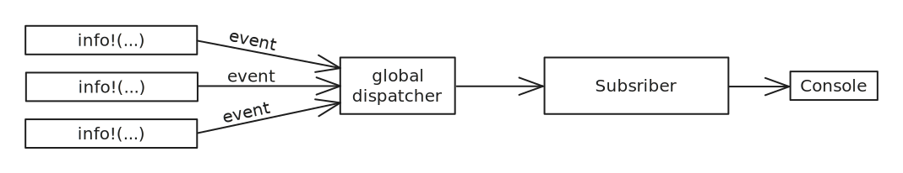
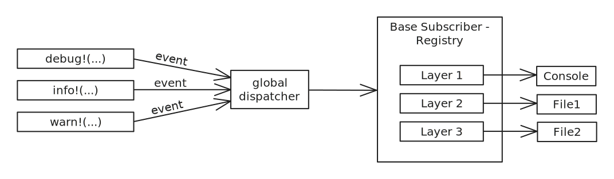

# Логирование

В рамках изучения логирования, мы будем рассматривать библиотеку tracing. Эта бибилотека представляет из себя целую экосистему для логирование, но основных крэйта в ней два:

* [tracing](https://crates.io/crates/tracing) — предоставляет API для логирования (является фасадом)
* [tracing-subscriber](https://crates.io/crates/tracing-subscriber) — реализация логгера для tracing

В экосистеме Rust так же присутствует другая популярная библиотека логирования — [log](https://crates.io/crates/log) (фасад) и её реализации: [env_logger](https://crates.io/crates/env_logger) и [log4rs](https://crates.io/crates/log4rs). Но мы сосредоточимся только на tracing по двум причинам:

* tracing изначально создана с прицелом на асинхронность, что важно для бекенд приложений
* tracing так же умеет работать с библиотеками, которые используют log для логирования

## Первый взгляд на tracing

Для начала нам нужно подключить в `Cargo.toml` соответствующие зависимости:

```toml
[package]
name = "test_rust"
version = "0.1.0"
edition = "2024"

[dependencies]
tracing = "0.1"
tracing-subscriber = { version = "0.3", features = ["env-filter", "time", "json"] }
```

Теперь мы готовы воспользоваться логгером:

```rust,noplayground
fn main() {
    tracing_subscriber::fmt().init(); // Включаем tracing логирование
    tracing::info!("Hello"); // Пишем в лог информационное сообщение
}
```

Если мы запустим программу, то увидим в консоли такое лог-сообщение.

```
$ cargo run
2025-12-15T23:04:17.046455Z  INFO test_rust: Hello
```

Оно состоит из следующих компонентов:

* `2025-12-15T23:04:17.046455Z` — время создания лог-сообщения
* `INFO` — уровень лог-сообщения
* `test_rust` — имя программы
* `Hello` — текст лог-сообщения

## Внутренее устройство

Давайте еще раз взглянем на наш пример:

```rust,noplayground
fn main() {
    tracing_subscriber::fmt().init();
    tracing::info!("Hello");
}
```

Запись `tracing_subscriber::fmt().init()` является сокращённой, и делает сразу несколько вещей. Для ясности, давайте распишем этот пример подробнее:

```rust,noplayground
use tracing_subscriber::FmtSubscriber;
use tracing_subscriber::fmt::SubscriberBuilder;
use tracing_subscriber::util::SubscriberInitExt;

fn main() {
    let builder: SubscriberBuilder = tracing_subscriber::fmt();
    let subscriber: FmtSubscriber = builder.finish();
    subscriber.init(); // регистрация сабскрайбера в глобальном диспатчере

    tracing::info!("Hello");
}
```

Здесь мы делаем следущее:

1. `tracing_subscriber::fmt()` — создаём билдер [SubscriberBuilder](https://docs.rs/tracing-subscriber/latest/tracing_subscriber/fmt/struct.SubscriberBuilder.html), который позволяет провести настройку сабскрайбера.
2. `builder.finish()` — создаём объект сабскрайбера ([Subscriber](https://docs.rs/tracing-subscriber/latest/tracing_subscriber/fmt/struct.Subscriber.html)), который является непосредственным обработчиком лог-сообщений. (В примере тип сабскрайбера — `FmtSubscriber`, но это просто псевдоним для генерик структуры `Subscriber`).
3. `subscriber.init()` — регистрируем объект сабскрайбера в глобальном диспетчере (dispatcher).
4. `tracing::info!("Hello")` — отправляем лог-событие глобальному диспетчеру, который перенаправит его для обработки в сабскрайбер.

Упрощённо, работа механизма логирования выглядит так:



Для нас, как для пользователей библиотеки tracing, наиболее важным элементом является сам `Subscriber`.

```rust,noplayground
pub struct Subscriber<
    N = format::DefaultFields, // перечень полей лог-сообщения
    E = format::Format<format::Full>, // формат лог-сообщения
    F = LevelFilter, // уровни логирования: TRACE, DEBUG, INFO, WARN, ERROR
    W = fn() -> io::Stdout, // то куда производится запись, по умолчанию - STDOUT
> {
    inner: layer::Layered<F, Formatter<N, E, W>>,
}
```

На данный момент эта структура должна быть совершенно непонятной, но к концу главы мы разберёмся со всеми её составляющими. А пока давайте приступим к практике логирования.

> [!NOTE]
> Если решите покопаться во внутренностях библиотеки, имейте ввиду, что есть трэйт [Subscriber](https://docs.rs/tracing-core/latest/tracing_core/subscriber/trait.Subscriber.html), объявленный в крэйте tracing, а есть одноимённая стурктура [Subscriber](https://docs.rs/tracing-subscriber/latest/tracing_subscriber/fmt/struct.Subscriber.html) из крэйта tracing-subscriber. В этой главе, мы в основном имеем дело со структурой `Subscriber`, но если вам понадобится реализовать какой-то очень специфический логгер, например, который пишет логи напрямую в базу данных, то вам, скорее всего, придётся реализовать именно трэйт `Subscriber`.

## Формат лог-записей

Билдер [SubscriberBuilder](https://docs.rs/tracing-subscriber/latest/tracing_subscriber/fmt/struct.SubscriberBuilder.html), с которым мы уже познакомились, позволяет настроить формат логирования для сабскрайбера. Билдер предоставляет следующие методы для настройки формата лог-записей:

* `with_ansi(bool)` — указывает будет ли логгер использовать управляющие ANSI коды для того, чтобы выделять разные части лог-записи разными цветами. При перенаправлении логов с консоли в файл, этот флаг следует устанавливать в `false`. По умолчанию: `true`.
* `with_file(bool)` — добавлять ли в лог-запись имя файла, из которого было произведено логирование. По умолчанию: `false`.
* `with_line_number(bool)` —  добавлять ли в лог-запись номер строки, из которой было произведено логирование. По умолчанию: `false`.
* `with_target(bool)` — добавлять ли в лог-запись имя программы. По умолчанию: `true`.
* `with_thread_ids(bool)` — добавлять ли в лог-запись ID потока, из которого было произведено логирование. По умолчанию: `false`.
* `with_thread_names(bool)` — добавлять ли в лог-запись имя потока, из которого было произведено логирование. По умолчанию: `false`.
* `with_timer(`[`Format`](https://docs.rs/tracing-subscriber/latest/tracing_subscriber/fmt/format/struct.Format.html)`)` — определяет формат даты и времени в лог-записи. По умолчанию: [UtcTime](https://docs.rs/tracing-subscriber/latest/tracing_subscriber/fmt/time/struct.UtcTime.html).
* `without_time()` — выключает отображение даты и времени в лог-записи.
* `json()` — лог-запись будет представлена в виде JSON объекта. Доступно только при включенной "json" фиче.

Для примера, настроим формат лог-сообщений так, чтобы убрать из них имя приложения, но добавить имя файла и номер строки. Плюс, вместо астрономического времени, будет отображаться сколько времени прошло с момента запуска программы.

```rust,noplayground
use tracing_subscriber::fmt::time::Uptime;

fn main() {
    tracing_subscriber::fmt()
        .with_target(false)
        .with_file(true)
        .with_line_number(true)
        .with_timer(Uptime::default())
        .init();

    tracing::info!("Hello");
}
```

Вывод программы:

```
$ cargo run
0.000186881s  INFO src/main.rs:11: Hello
```

Отдельно стоит отметить форматирование в виде JSON объекта:

```rust,noplayground
fn main() {
    tracing_subscriber::fmt().json().init();
    tracing::info!("Hello");
}
```

Программа выведет:

```
$ cargo run
{"timestamp":"2025-12-17T14:28:29.197314Z","level":"INFO","fields":{"message":"Hello"},"target":"test_rust"}
```

## Уровни логирования

tracing предлагает пять уровней логирования: TRACE, DEBUG, INFO, WARN, ERROR. По умолчанию логируются все лог-сообщения с уровнем INFO и выше.

То есть такая программа:

```rust,noplayground
fn main() {
    tracing_subscriber::fmt().init();

    tracing::trace!("Hello");
    tracing::debug!("Hello");
    tracing::info!("Hello");
    tracing::warn!("Hello");
    tracing::error!("Hello");
}
```

выведет:

```
$ cargo run
2025-12-16T14:57:02.786497Z  INFO test_rust: Hello
2025-12-16T14:57:02.786556Z  WARN test_rust: Hello
2025-12-16T14:57:02.786567Z ERROR test_rust: Hello
```

Чтобы установить отображаемый уровень логирования, используется метод [with_max_level](https://docs.rs/tracing-subscriber/latest/tracing_subscriber/fmt/struct.SubscriberBuilder.html#method.with_max_level) из билдера `SubscriberBuilder`. Например, если мы хотим, чтобы выводились уровни DEBUG, INFO, WARN и ERROR, то надо настроить сабскрайбер так:

```rust,noplayground
tracing_subscriber::fmt()
    .with_max_level(LevelFilter::DEBUG)
    .init();
```

## Фильтрация сообщений

Если вы включите DEBUG или TRACING уровень логирования в приложении, в котором имеются зависимости (другие Rust библиотеки), то велика вероятность, что кроме логов непосредственно из вашего кода, вы увидите целый шквал сообщений из кода зависимостей.

К счастью tracing-subscriber позволяет фильтровать лог-сообщения по таким критериям как:

* target — он же крэйт
* модуль
* уровень лога

Фильтр задаётся на билдере `SubscriberBuilder` при помощи метода [with_env_filter](https://docs.rs/tracing-subscriber/latest/tracing_subscriber/fmt/struct.SubscriberBuilder.html#method.with_env_filter), который принимает аргумент типа `impl Into<EnvFilter>`.

Объект [EnvFilter](https://docs.rs/tracing-subscriber/latest/tracing_subscriber/filter/struct.EnvFilter.html) можно сконструировать "руками", но гораздо проще задать его строкой. Эта строка должна содержать разделённые запятой секции вида `таргет::модуль=уровень`, где:

* таргет (опционален) — имя крэйта из которого происходит логирование
* модуль (опционален) — имя модуля в этом крэйте из которого происходит логирование
* уровень — уровень логирования

Например, строка `"myapp::mod1=debug,myapp::mod2=trace,info"` указывает, что для всего приложения должен использоваться уровень INFO, но для модуля `mod1` из крэйта `myapp` должен использоваться уровень DEBUG, а для модуля `mod1` из крэйта `myapp` — TRACE.

Важно заметить, что порядок секций в строке не важен: если мы поменяем строку на `"info,myapp::mod1=debug,myapp::mod2=trace"`, то ничего не изменится.

В качестве примера рассмотрим программу с двумя модулями: для одного модуля будет установлен DEBUG уровень,  для другого — WARN, а для всего приложения — INFO.

```rust,noplayground
fn main() {
    tracing_subscriber::fmt()
        .with_env_filter("test_rust::mod_a=debug,test_rust::mod_b=warn,info")
        .init();

    mod_a::func();
    mod_b::func();
    tracing::info!("from root: test");
}

mod mod_a {
    pub fn func() {
        // выведется, так как для этого модуля уровень логирования - DEBUG
        tracing::debug!("from mod_a: test");
    }
}

mod mod_b {
    pub fn func() {
        // не выведется, так как для этого модуля уровень логирования - WARN
        tracing::info!("from mod_b: test");
    }
}
```

Запустим программу:

```
$ cargo run
2025-12-16T20:09:58.958779Z DEBUG test_rust::mod_a: from mod_a: test
2025-12-16T20:09:58.958855Z  INFO test_rust: from root: test
```

Альтернативно, вместо указания правил фильтрации в виде одной строки, мы можем создать объект `EnvFilter` вручную:

```rust,noplayground
let filter = tracing_subscriber::EnvFilter::from_default_env()
    .add_directive("test_rust::mod_a=debug".parse().unwrap())
    .add_directive("test_rust::mod_b=warn".parse().unwrap())
    .add_directive("info".parse().unwrap());

tracing_subscriber::fmt()
    .with_env_filter(filter)
    .init();
```

но на практике так обычно не делают, потому что для програм на Rust принято задавать опции фильтрации логов при помощи переменной окружения `RUST_LOG`.

Для этого достаточно просто сконфигурировать фильтр логов так:

```rust,noplayground
tracing_subscriber::fmt()
    .with_env_filter(tracing_subscriber::EnvFilter::from_default_env())
    .init();
```

и после этого можно задавать опции фильтрации через переменную окружения:

```
$ export RUST_LOG="test_rust::mod_a=debug,test_rust::mod_b=warn,info"
$ cargo run
2025-12-16T20:09:58.958779Z DEBUG test_rust::mod_a: from mod_a: test
2025-12-16T20:09:58.958855Z  INFO test_rust: from root: test
```

> [!NOTE]
> На Windows:
> 
> ```
> set RUST_LOG="test_rust::mod_a=debug,test_rust::mod_b=warn,info"
> cargo run
> 2025-12-16T20:09:58.958779Z DEBUG test_rust::mod_a: from mod_a: test
> 2025-12-16T20:09:58.958855Z  INFO test_rust: from root: test
> ```

## Запись логов в файл

По умолчанию логи пишутся на стандартный вывод, но это можно изменить путём задания альтернативного приёмника при помощи метода [with_writer](https://docs.rs/tracing-subscriber/latest/tracing_subscriber/fmt/struct.SubscriberBuilder.html#method.with_writer) у билдера `SubscriberBuilder`.

Этот метод принимает объект любого типа, реализующего трэйт [MakeWriter](https://docs.rs/tracing-subscriber/latest/tracing_subscriber/fmt/trait.MakeWriter.html), что включает любые типы, реализующие трэйт [std::io::Write](https://doc.rust-lang.org/std/io/trait.Write.html). А так как тип `std::fs::File` реализует `std::io::Write`, то примитивное логирование в файл можно реализовать так:

```rust,noplayground
fn main() {
    let file = std::fs::File::create("app.log").unwrap();
    tracing_subscriber::fmt()
        .with_writer(file)
        .with_ansi(false) // консольные управляющие символы в файле не нужны
        .init();
    tracing::info!("Hello");
}
```

Запустив эту программу вы увидете, что действительно был создан файл `app.log`.

Разумеется в долгоживущем бекенд приложении нужна более гибкая запись логов в файл. Экосистема tracing предлагает бибилотеку [tracing-appender](https://crates.io/crates/tracing-appender), которая умеет:

* производить запись логов в файл в неблокирующем режиме
* автоматически переключаться на новый лог файл каждый день/час/минуту/и т.д.
* автоматически удалять устаревшие файлы с логами

Для начала подключим tracing-appender в `Cargo.toml`.

```toml,noplayground
[package]
name = "test_rust"
version = "0.1.0"
edition = "2024"

[dependencies]
tracing = "0.1"
tracing-subscriber = { version = "0.3", features = ["env-filter", "time"] }
tracing-appender = "0.2"
```

Теперь давайте настроим логирование так, чтобы запись логов производилась в каталог `logs`, а файлы с логами имели префикс `app.log`, и новый лог файл создавался каждый час.

```rust,noplayground
fn main() {
    let appender = tracing_appender::rolling::daily("logs", "app.log");

    tracing_subscriber::fmt()
        .with_writer(appender)
        .with_ansi(false)
        .init();

    tracing::info!("Hello");
}
```

После запуска программы, в каталоге проекта должна появится деректория logs, в которой должен находиться файл с именем формата `app.log.год-месяц-день`.

Если нам потребуется более гибкая настройка, то мы должны воспользоваться билдером [RollingFileAppender](https://docs.rs/tracing-appender/latest/tracing_appender/rolling/struct.RollingFileAppender.html).

```rust,noplayground
use tracing_appender::rolling::{RollingFileAppender, Rotation};

fn main() {
    let appender = RollingFileAppender::builder()
        .rotation(Rotation::DAILY) // ротация лог-файла каждый день
        .max_log_files(10) // хранить только 10 последних лог-файлов
        .filename_prefix("app") // префикс имени лог-файла до компонента даты
        .filename_suffix("log") // суффикс имени лог-файла после компонента даты
        .build("logs") // имя директории для лог-файлов
        .unwrap();

    tracing_subscriber::fmt()
        .with_writer(appender)
        .with_ansi(false)
        .init();

    tracing::info!("Hello");
}
```

После запуска в каталоге `logs` должен появится лог-файл с именем формата `app.год-месяц-день.log`. Например, `app.2025-12-17.log`.

Если мы хотим писать логи одновременно и в файл, и на консоль, то для простоты можем воспользоваться комбинатором [and](https://docs.rs/tracing-subscriber/latest/tracing_subscriber/fmt/writer/trait.MakeWriterExt.html#method.and) из утилитарного трэйта [MakeWriterExt](https://docs.rs/tracing-subscriber/latest/tracing_subscriber/fmt/writer/trait.MakeWriterExt.html), который позволяет скомбинировать два приёмника логов в один.

```rust,noplayground
use tracing_subscriber::fmt::writer::MakeWriterExt;

fn main() {
    let file_appender = tracing_appender::rolling::daily("logs", "app.log")
        .with_max_level(tracing::Level::INFO);

    let stdout_appender = std::io::stdout
        .with_max_level(tracing::Level::DEBUG);

    tracing_subscriber::fmt()
        .with_writer(stdout_appender.and(file_appender))
        .with_ansi(false)
        .init();

    tracing::info!("Hello");
}
```

В случае если для каждого из прёмников логов трубуется более тонкая настройка, придётся воспользоваться слоями, о которых мы поговорим дальше в этой главе.

## Неблокирующее логирование

Как мы уже сказали в предыдущей секции, библиотека tracing-appender предоставляет не только функциональность для гибкой записи логов в файл, но так же и функциональность для неблокирующей записи.

Для того, чтобы сделать из синхронного писателя неблокирующий, нужно воспользоваться функцией [non_blocking](https://docs.rs/tracing-appender/latest/tracing_appender/non_blocking/index.html):

```rust,noplayground
fn main() {
    let (non_blocking, _guard) = tracing_appender::non_blocking(std::io::stdout());

    tracing_subscriber::fmt()
        .with_writer(non_blocking)
        .init();

    tracing::info!("Hello");
}
```

Функция `non_blocking` запускает отдельный поток, который по каналу принимает лог-сообщения и производит запись. Функция `non_blocking` возвращает кортеж из двух объектов:

1. Объект типа [NonBlocking](https://docs.rs/tracing-appender/latest/tracing_appender/non_blocking/struct.NonBlocking.html), который по сути является обёрткой над отправителем (Sender) лог-сообщений в канал.
2. Охранный объект типа [WorkerGuard](https://docs.rs/tracing-appender/latest/tracing_appender/non_blocking/struct.WorkerGuard.html), чей деструктор сначала убедится, что все лог-сообщения из канала записаны, а после завершит поток у уничтожит канал. Нужен для корректного завершения приложения.

> [!WARNING]
> Важно! Если новые лог-сообщения будут поступать быстрее, чем поток будет успевать их записывать, то канал переполнится, и новые лог-сообщения будут просто отбрасываться. Размер канала по умолчанию расчитан 128000 на лог-сообщений.

## Слои

[Layer](https://docs.rs/tracing-subscriber/latest/tracing_subscriber/layer/trait.Layer.html) (слой) — трэйт, задающий интерфейс для фильтрации, форматирования и записи логов. Совсем как сабскрайбер. Однако в отличии от сабскрайберов, несколько слоёв можно объединить в один, и использовать этот объёдинённый слой как сабскайбер. При этом каждый из слоёв может быть сконфигурирован так же гибко, как сабскрайбер.

Например, мы можем создать один слой для записи логов в стандартный вывод, другой слой — для записи в файла. Комбинация этих слоёв будет производить запись и в стандартный вывод, и в файл.

Для создания логгера из слоёв, мы должны использовать объект [Registry](https://docs.rs/tracing-subscriber/latest/tracing_subscriber/registry/struct.Registry.html), который создаётся функцией `tracing_subscriber::registry()`. Это легче понять на примере:

```rust,noplayground
use tracing_subscriber::{fmt::layer, layer::SubscriberExt, util::SubscriberInitExt};

fn main() {
    // Слой для записи в файл
    let file_layer = layer()
        .with_writer(tracing_appender::rolling::daily("logs", "app.log"))
        .with_ansi(false);

    // Слой для записи на консоль
    let stdout_layer = layer()
        .with_writer(std::io::stdout);

    tracing_subscriber::registry() // registry() вместо fmt() 
        .with(stdout_layer)
        .with(file_layer)
        .init();

    tracing::info!("Hello");
}
```

Запустив программу, мы увидим, что она записала лог-сообщение и на консоль, и в файл.

***

И на этом моменте мы готовы еще раз взглянуть на определение структуры `Subscriber`, которое мы видели в самом начале главы:

```rust,noplayground
pub struct Subscriber<
    N = format::DefaultFields, // перечень полей лог-сообщения
    E = format::Format<format::Full>, // формат лог-сообщения
    F = LevelFilter, // уровни логирования: TRACE, DEBUG, INFO, WARN, ERROR
    W = fn() -> io::Stdout, // то куда производится запись, по умолчанию - STDOUT
> {
    inner: layer::Layered<F, Formatter<N, E, W>>, // слои
}
```

Как видите, эта структура содержит поле `inner`, которое имеет тип [Layered](https://docs.rs/tracing-subscriber/latest/tracing_subscriber/layer/struct.Layered.html) — хранилище слоё. На самом деле, все наши сабскрайберы из предыдущих примеров, всегда состояли из слоёв. Просто у них был только один слой.

Теперь мы можем детализировать раньше приведённую диаграмму, указав внутреннее устройство стандартного сабскрайбера (структуры из библиотеки tracing-subscriber).



Т.е. когда мы конфигурируем логгер просто как:

```rust,noplayground
tracing_subscriber::fmt().init()
```

то создаётся сабскрайбер с одним слоем, который печатает логи в STDOUT.

## Span

Последнее с чем нам осталось познакомится — [span](https://docs.rs/tracing/latest/tracing/span/index.html#the-span-lifecycle) (диапазон, охват). Это понятие сложно перевести на русский, поэтому мы будет называеть его просто span.

Span представляет некий участок кода, к которому можно привязать контекст логирования с дополнительными атрибутами.

И это гораздо проще понять на примере:

```rust,noplayground
use tracing::{Span, span::Entered};

fn main() {
    tracing_subscriber::fmt().init();

    // Для INFO логов создаём span с атрибутом attr1 и значение 5
    let my_span: Span = tracing::span!(tracing::Level::INFO, "span1", attr1 = 5);
    let _enter: Entered<'_> = my_span.enter();
    
    tracing::info!("Hello");
}
```

Такая программа напечатает:

```
2025-12-17T23:07:23.633043Z  INFO span1{attr1=5}: test_rust: Hello
```

Как видите, в строке лога добавилось `span1{attr1=5}`.

Как это работает?

* Сначала мы создаём объект типа [Span](https://docs.rs/tracing/latest/tracing/struct.Span.html), при помощи которого говорим, что хотим, чтобы для логов с уровнем INFO добавлялся атрибут с именем "attr1" и значением `5`.
* Далее мы мы "активируем" span в текущей области путём вызова метода [enter](https://docs.rs/tracing/latest/tracing/struct.Span.html#method.enter). Этот метод возвращает объект типа [Entered](https://docs.rs/tracing/latest/tracing/span/struct.Entered.html), который представляет из себя активированный span.
* В той области кода, в которой жив объект `Entered`, к логам будут добавляться атрибуты из span объекта.

Рассмотрим следующий пример, который наглядно демонстрирует, что атрибуты из span добавляются в лог-сообщение, только в той области, где существует объект `Entered`.

```rust,noplayground
fn main() {
    tracing_subscriber::fmt().init();

    let my_span = tracing::span!(tracing::Level::INFO, "span1", attr1 = 5);
    {
        let mut _enter = my_span.enter();
        tracing::info!("Hello 1");
    }
    tracing::info!("Hello 2");
}
```

Вывод программы.

```
2025-12-17T23:35:55.528112Z  INFO span1{attr1=5}: test_rust: Hello 1
2025-12-17T23:35:55.528148Z  INFO test_rust: Hello 2
```

***

В большинстве ситуаций мы хотим "активировать" span сразу после его создания, но мы не можем написать так:

```rust,noplayground
let my_span: Entered<'_> = tracing::span!(Level::INFO, "span1", attr1 = 5).enter();
```

Дело в том, что объект `Entered` хранит ссылку на объект span, от которого он был создан. А так как в коде выше, объект span создаётся и сразу же уничтожается, то ссылку становится хранить не на что.

Для решения этой проблемы тип `Span` предлагает другой метод — [entered](https://docs.rs/tracing/latest/tracing/struct.Span.html#method.entered), который возвращает объект типа [EnteredSpan](https://docs.rs/tracing/latest/tracing/span/struct.EnteredSpan.html). Он ведёт себя подобно `Entered`, но вместо того, чтобы держать ссылку на объект `Span`, он забирает объект `Span` себе во владение.

```rust,noplayground
use tracing::{Level, span::EnteredSpan};

fn main() {
    tracing_subscriber::fmt().init();

    let my_span: EnteredSpan = tracing::span!(Level::INFO, "span1", attr1 = 5)
        .entered();
    tracing::info!("Hello 1");
    my_span.exit();
    tracing::info!("Hello 2");
}
```

Программа выводит:

```
2025-12-18T00:34:31.045841Z  INFO span1{attr1=5}: test_rust: Hello 1
2025-12-18T00:34:31.045887Z  INFO test_rust: Hello 2
```

В работе, подход с методом `entered` используется чаще, потому что он короче. Но в этой главе мы продолжим использовать метод `enter`, так как он более наглядный.

### Пересечение span

Когда мы создаём объект span в области, где <ins>уже активирован</ins> другой span, то уже активированный span становится родителем свежесозданного. Это означает, что в лог-сообщение попадут атрибуты и из родителского, и из дочернего span-ов.

Рассмотрим это на примере:

```rust,noplayground
fn main() {
    tracing_subscriber::fmt().init();

    let span1 = tracing::span!(tracing::Level::INFO, "span1", attr1 = 5);
    let _enter1 = span1.enter();

    let span2 = tracing::span!(tracing::Level::INFO, "span2", attr2 = 7);
    let _enter2 = span2.enter();
    
    tracing::info!("Hello");
}
```

Вывод программы:

```
2025-12-17T23:08:54.836930Z  INFO span1{attr1=5}:span2{attr2=7}: test_rust: Hello
```

Теперь давайте перепишем этот пример так, чтобы второй объект span создавался до активации первого span. В такой ситуации отношение родитель-потомок установлено не будет, и последний активированный span просто перекроет собой всё, что было активировано до него.

```rust,noplayground
fn main() {
    tracing_subscriber::fmt().init();

    let span1 = tracing::span!(tracing::Level::INFO, "span1", attr1 = 5);
    let span2 = tracing::span!(tracing::Level::INFO, "span2", attr2 = 7);

    let _enter1 = span1.enter();
    let _enter2 = span2.enter(); // перекроет собой span1
    
    tracing::info!("Hello");
}
```

Вывод программы:

```
2025-12-17T23:09:36.704697Z  INFO span2{attr2=7}: test_rust: Hello
```

Так же, надо заметить, что макрос `span!` позволяет при помощи параметра `parent` явно указать родительский span.

```rust,noplayground
fn main() {
    tracing_subscriber::fmt().init();

    let span1 = tracing::span!(tracing::Level::INFO, "span1", attr1 = 5);
    let span2 = tracing::span!(parent: &span1, tracing::Level::INFO, "span2", attr2 = 7);

    let _enter1 = span1.enter();
    let _enter2 = span2.enter();
    
    tracing::info!("Hello");
}
```

Эта программа уже выводит атрибуты от обоих span:

```
2025-12-18T00:55:30.040449Z  INFO span1{attr1=5}:span2{attr2=7}: test_rust: Hello
```

### instrument

Библиотека tracing предоставляет макрос `instrument`, который позволяет "инструментировать" определение функции, путём оборачивания её тела в span.

Рассмотрим пример:

```rust,noplayground
fn main() {
    tracing_subscriber::fmt().init();
    let _ = func(1, "PARAM2");
}

#[tracing::instrument]
fn func(param1: i32, param2: &str) -> String {
    tracing::info!("Hello");
    String::from("RESULT")
}
```

Вывод программы

```
2025-12-18T15:27:16.330514Z  INFO func{param1=1 param2="PARAM2"}: test_rust: Hello
```

Как видите, инструментирование создаёт span с таким же именем, как у функции, и с атрибутами, совпадающими с аргументами функции.

Максрос `instrument` предлагает ряд параметров для настройки:

```rust,noplayground
fn main() {
    tracing_subscriber::fmt()
        .without_time()
        .init();
    let _ = func(1, "PARAM2");
}

#[tracing::instrument(
    name = "span_func", // имя span
    level = "info",     // уровень логирования
    fields(attr1 = %param1, attr2="xxx"), // дополнительные атрибуте
    skip(param1), // не включать аргумент param2 в атрибуты
    ret // включить автоматическое логирование результата функции
)]
fn func(param1: i32, param2: &str) -> String {
    tracing::info!("Hello");
    String::from("RESULT")
}
```

Вывод программы:

```
INFO span_func{param2="PARAM2" attr1=1 attr2="xxx"}: test_rust: Hello
INFO span_func{param2="PARAM2" attr1=1 attr2="xxx"}: test_rust: return="RESULT"
```

### Внутренее устройство span

При активации объекта span, его данные помещаются в thread local, что позволяет сохранять доступ к объекту span даже во вложенных функциях.

Например:

```rust,noplayground
fn main() {
    tracing_subscriber::fmt().init();

    let span = tracing::span!(tracing::Level::INFO, "span1", attr1 = 5);
    let _entered = span.enter();
    
    func();
}

fn func() {
    tracing::info!("Hello");
}
```

Вывод программы:

```
2025-12-18T00:58:56.030620Z  INFO span1{attr1=5}: test_rust: Hello
```

Как видите, атрибуты из span попали в лог вывод из функции.

> [!WARNING]
> При написании async кода, span может работать некорректно, если в области действия активного span объекта, вставить вызов `await`. Но об этом мы поговорим позже.

