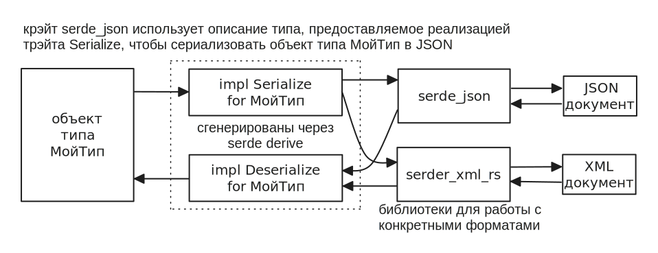

# Сериализация

## serde

В языке Rust нет никаких стандартных механизмов для сериализации и десерериализации данных, однако уже давно стандартом де факто для сериализации стала библиотека [serde](https://crates.io/crates/serde).

serde не содержит функциональности для сериализации в какие-либо форматы, например JSON или XML, но предоставляет трэйты и процедурные макросы, которые позволяют автоматически сгенерировать для пользовательских типов набор специальных методов. Эти методы выдают метаинформацию о типе, а так же позволяют читать поля и записывать в них значения. Уже на основе этих методов, другие библиотеки, работающие с конкретными форматами (JSON, XML, YAML), производят сериализацию и десериализацию.

Крэйт serde предоставляет два основных трэйта: [Serialize](https://docs.rs/serde/latest/serde/trait.Serialize.html) и [Deserialize](https://docs.rs/serde/latest/serde/trait.Deserialize.html). Первый необходим для сериализации, второй — для десериализации.



---

Допустим у нас есть некий тип `Employee`, который мы хотели бы иметь возможность сериализовать в различные форматы.

```rust,noplayground
struct Employee {
  id: u64,
  name: String,
}
```

Для начала добавим в `Cargo.toml` зависимость serde.

```toml
[package]
name = "test_rust"
version = "0.1.0"
edition = "2024"

[dependencies]
serde = { version = "1", features = ["derive"] }
```

Далее мы должны аннотировать нашу структуру трэйтами `Serialize` и `Deserialize`.

```rust,noplayground
use serde::{Serialize, Deserialize};

#[derive(Serialize, Deserialize)]
struct Employee {
  id: u64,
  name: String,
}
```

Теперь для структуры `Employee` будут сгенерированы реализации `Serialize` и `Deserialize`, которые позволят использовать её библиотекам сериалзиации в конкретные форматы.

> [!TIP]
> <details>
> 
> <summary>Что конкретно генерирует serde?</summary>
> 
> Чтобы увидеть код реализаций `Deserialize` и `Serialize` для нашей структуры `Employee`, создадим простую программу, состоящую из одного лишь объявления структуры.
> 
> ```rust,noplayground
> use serde::{Deserialize, Serialize};
> 
> #[derive(Serialize, Deserialize)]
> struct Employee {
>     id: u64,
>     name: String,
> }
> 
> fn main() {}
> ```
> 
> Далее выполним  команду `cargo expand`, которая напечатает на консоль содержимое `main.rs` после того как все макросы обработаны.
> 
> (если утилита expand не установлена, сначала выполните `cargo install expand`)
> 
> ```rust,noplayground
> #![feature(prelude_import)]
> #[macro_use]
> extern crate std;
> #[prelude_import]
> use std::prelude::rust_2024::*;
> use serde::{Deserialize, Serialize};
> struct Employee {
>     id: u64,
>     name: String,
> }
> #[doc(hidden)]
> #[allow(
>     non_upper_case_globals,
>     unused_attributes,
>     unused_qualifications,
>     clippy::absolute_paths,
> )]
> const _: () = {
>     #[allow(unused_extern_crates, clippy::useless_attribute)]
>     extern crate serde as _serde;
>     #[automatically_derived]
>     impl _serde::Serialize for Employee {
>         fn serialize<__S>(
>             &self,
>             __serializer: __S,
>         ) -> _serde::__private228::Result<__S::Ok, __S::Error>
>         where
>             __S: _serde::Serializer,
>         {
>             let mut __serde_state = _serde::Serializer::serialize_struct(
>                 __serializer,
>                 "Employee",
>                 false as usize + 1 + 1,
>             )?;
>             _serde::ser::SerializeStruct::serialize_field(
>                 &mut __serde_state,
>                 "id",
>                 &self.id,
>             )?;
>             _serde::ser::SerializeStruct::serialize_field(
>                 &mut __serde_state,
>                 "name",
>                 &self.name,
>             )?;
>             _serde::ser::SerializeStruct::end(__serde_state)
>         }
>     }
> };
> #[doc(hidden)]
> #[allow(
>     non_upper_case_globals,
>     unused_attributes,
>     unused_qualifications,
>     clippy::absolute_paths,
> )]
> const _: () = {
>     #[allow(unused_extern_crates, clippy::useless_attribute)]
>     extern crate serde as _serde;
>     #[automatically_derived]
>     impl<'de> _serde::Deserialize<'de> for Employee {
>         fn deserialize<__D>(
>             __deserializer: __D,
>         ) -> _serde::__private228::Result<Self, __D::Error>
>         where
>             __D: _serde::Deserializer<'de>,
>         {
>             #[allow(non_camel_case_types)]
>             #[doc(hidden)]
>             enum __Field {
>                 __field0,
>                 __field1,
>                 __ignore,
>             }
>             #[doc(hidden)]
>             struct __FieldVisitor;
>             #[automatically_derived]
>             impl<'de> _serde::de::Visitor<'de> for __FieldVisitor {
>                 type Value = __Field;
>                 fn expecting(
>                     &self,
>                     __formatter: &mut _serde::__private228::Formatter,
>                 ) -> _serde::__private228::fmt::Result {
>                     _serde::__private228::Formatter::write_str(
>                         __formatter,
>                         "field identifier",
>                     )
>                 }
>                 fn visit_u64<__E>(
>                     self,
>                     __value: u64,
>                 ) -> _serde::__private228::Result<Self::Value, __E>
>                 where
>                     __E: _serde::de::Error,
>                 {
>                     match __value {
>                         0u64 => _serde::__private228::Ok(__Field::__field0),
>                         1u64 => _serde::__private228::Ok(__Field::__field1),
>                         _ => _serde::__private228::Ok(__Field::__ignore),
>                     }
>                 }
>                 fn visit_str<__E>(
>                     self,
>                     __value: &str,
>                 ) -> _serde::__private228::Result<Self::Value, __E>
>                 where
>                     __E: _serde::de::Error,
>                 {
>                     match __value {
>                         "id" => _serde::__private228::Ok(__Field::__field0),
>                         "name" => _serde::__private228::Ok(__Field::__field1),
>                         _ => _serde::__private228::Ok(__Field::__ignore),
>                     }
>                 }
>                 fn visit_bytes<__E>(
>                     self,
>                     __value: &[u8],
>                 ) -> _serde::__private228::Result<Self::Value, __E>
>                 where
>                     __E: _serde::de::Error,
>                 {
>                     match __value {
>                         b"id" => _serde::__private228::Ok(__Field::__field0),
>                         b"name" => _serde::__private228::Ok(__Field::__field1),
>                         _ => _serde::__private228::Ok(__Field::__ignore),
>                     }
>                 }
>             }
>             #[automatically_derived]
>             impl<'de> _serde::Deserialize<'de> for __Field {
>                 #[inline]
>                 fn deserialize<__D>(
>                     __deserializer: __D,
>                 ) -> _serde::__private228::Result<Self, __D::Error>
>                 where
>                     __D: _serde::Deserializer<'de>,
>                 {
>                     _serde::Deserializer::deserialize_identifier(
>                         __deserializer,
>                         __FieldVisitor,
>                     )
>                 }
>             }
>             #[doc(hidden)]
>             struct __Visitor<'de> {
>                 marker: _serde::__private228::PhantomData<Employee>,
>                 lifetime: _serde::__private228::PhantomData<&'de ()>,
>             }
>             #[automatically_derived]
>             impl<'de> _serde::de::Visitor<'de> for __Visitor<'de> {
>                 type Value = Employee;
>                 fn expecting(
>                     &self,
>                     __formatter: &mut _serde::__private228::Formatter,
>                 ) -> _serde::__private228::fmt::Result {
>                     _serde::__private228::Formatter::write_str(
>                         __formatter,
>                         "struct Employee",
>                     )
>                 }
>                 #[inline]
>                 fn visit_seq<__A>(
>                     self,
>                     mut __seq: __A,
>                 ) -> _serde::__private228::Result<Self::Value, __A::Error>
>                 where
>                     __A: _serde::de::SeqAccess<'de>,
>                 {
>                     let __field0 = match _serde::de::SeqAccess::next_element::<
>                         u64,
>                     >(&mut __seq)? {
>                         _serde::__private228::Some(__value) => __value,
>                         _serde::__private228::None => {
>                             return _serde::__private228::Err(
>                                 _serde::de::Error::invalid_length(
>                                     0usize,
>                                     &"struct Employee with 2 elements",
>                                 ),
>                             );
>                         }
>                     };
>                     let __field1 = match _serde::de::SeqAccess::next_element::<
>                         String,
>                     >(&mut __seq)? {
>                         _serde::__private228::Some(__value) => __value,
>                         _serde::__private228::None => {
>                             return _serde::__private228::Err(
>                                 _serde::de::Error::invalid_length(
>                                     1usize,
>                                     &"struct Employee with 2 elements",
>                                 ),
>                             );
>                         }
>                     };
>                     _serde::__private228::Ok(Employee {
>                         id: __field0,
>                         name: __field1,
>                     })
>                 }
>                 #[inline]
>                 fn visit_map<__A>(
>                     self,
>                     mut __map: __A,
>                 ) -> _serde::__private228::Result<Self::Value, __A::Error>
>                 where
>                     __A: _serde::de::MapAccess<'de>,
>                 {
>                     let mut __field0: _serde::__private228::Option<u64> = _serde::__private228::None;
>                     let mut __field1: _serde::__private228::Option<String> = _serde::__private228::None;
>                     while let _serde::__private228::Some(__key) = _serde::de::MapAccess::next_key::<
>                         __Field,
>                     >(&mut __map)? {
>                         match __key {
>                             __Field::__field0 => {
>                                 if _serde::__private228::Option::is_some(&__field0) {
>                                     return _serde::__private228::Err(
>                                         <__A::Error as _serde::de::Error>::duplicate_field("id"),
>                                     );
>                                 }
>                                 __field0 = _serde::__private228::Some(
>                                     _serde::de::MapAccess::next_value::<u64>(&mut __map)?,
>                                 );
>                             }
>                             __Field::__field1 => {
>                                 if _serde::__private228::Option::is_some(&__field1) {
>                                     return _serde::__private228::Err(
>                                         <__A::Error as _serde::de::Error>::duplicate_field("name"),
>                                     );
>                                 }
>                                 __field1 = _serde::__private228::Some(
>                                     _serde::de::MapAccess::next_value::<String>(&mut __map)?,
>                                 );
>                             }
>                             _ => {
>                                 let _ = _serde::de::MapAccess::next_value::<
>                                     _serde::de::IgnoredAny,
>                                 >(&mut __map)?;
>                             }
>                         }
>                     }
>                     let __field0 = match __field0 {
>                         _serde::__private228::Some(__field0) => __field0,
>                         _serde::__private228::None => {
>                             _serde::__private228::de::missing_field("id")?
>                         }
>                     };
>                     let __field1 = match __field1 {
>                         _serde::__private228::Some(__field1) => __field1,
>                         _serde::__private228::None => {
>                             _serde::__private228::de::missing_field("name")?
>                         }
>                     };
>                     _serde::__private228::Ok(Employee {
>                         id: __field0,
>                         name: __field1,
>                     })
>                 }
>             }
>             #[doc(hidden)]
>             const FIELDS: &'static [&'static str] = &["id", "name"];
>             _serde::Deserializer::deserialize_struct(
>                 __deserializer,
>                 "Employee",
>                 FIELDS,
>                 __Visitor {
>                     marker: _serde::__private228::PhantomData::<Employee>,
>                     lifetime: _serde::__private228::PhantomData,
>                 },
>             )
>         }
>     }
> };
> fn main() {}
> ```
> 
> Как видите, реализация `Serialize` очень простая. Она состояит из метода, который выдаёт метаинформацию о структуре: имя cтруктуры и перечень полей.
> 
> Реализация `Deserialize` куда сложнее. В рамках неё генерируется визитор (шаблон Visitor), который используется для обхода полей структуры.
> 
> </details>

## Сериализация в JSON

Теперь, давайте разберёмся как нам сериализовать нашу структуру `Employee` в JSON.

Для начала нам понадобится добавить зависимость на [serde_json](https://crates.io/crates/serde_json) в `Cargo.toml`:

```toml
[package]
name = "test_rust"
version = "0.1.0"
edition = "2024"

[dependencies]
serde = { version = "1", features = ["derive"] }
serde_json = "1"
```

Теперь мы можем использовать функции:

* [serde_json::to_string](https://docs.rs/serde_json/latest/serde_json/fn.to_string.html) — сериализует объект в JSON строку
* [serder_json::from_str](https://docs.rs/serde_json/latest/serde_json/fn.from_str.html) — десериализует JSON строку в объект

Пример:

```rust,edition2024
# use serde;
# use serde_json;
use serde::{Deserialize, Serialize};

#[derive(Debug, Serialize, Deserialize)]
struct Employee {
    id: u64,
    name: String,
}

fn main() {
    // объект структуры
    let emp1 = Employee {
        id: 1,
        name: "John Doe".to_string(),
    };

    // сериализация в JSON строку
    let json = serde_json::to_string(&emp1).unwrap(); // сериализуем в JSON
    println!("{json}"); // {"id":1,"name":"John Doe"}

    // десериализация из JSON строки
    let emp2: Employee = serde_json::from_str( // десериализуем из JSON
        r#"{ "id" : 2, "name" : "Ivan Ivanov" }"#
    ).unwrap();
    println!("{emp2:?}"); // Employee { id: 2, name: "Ivan Ivanov" }
}
```

### serde_json::Value

Так же в крэйте serde_json определёно перечисление [Value](https://docs.rs/serde_json/latest/serde_json/enum.Value.html), которое по сути является отображением JSON типов на Rust перечисление.

```rust,noplayground
pub enum Value {
    Null,
    Bool(bool),
    Number(Number),
    String(String),
    Array(Vec<Value>),
    Object(Map<String, Value>),
}
```

Если мы хотим "вручную", разобрать JSON документ, то мы можем распарсить документ в объект `Value`, который потом можно разбирать удобным для нас способом.

Чтобы из текстового JSON документа получить объект `Value`, используется уже знакомая нам функция `serde_json::from_str`:

```rust,noplayground
let v: Value = serde_json::from_str("{ \"a\": 1 }").expect("Invalid json");
```

Далее, при помощи паттерн-матчинга можно разбирать объект `Value`.

Продемонстрируем на примере:

```rust,edition2024
# use serde;
# use serde_json;
use serde_json::Value;

fn main() {
    // Парсим JSON документ, содержащий число
    let v1: Value = serde_json::from_str("5").unwrap();
    match v1 {
        Value::Number(n) => println!("Number: {n}"),
        _ => (),
    }

    // Парсим JSON документ, содержащий строку
    let v2: Value = serde_json::from_str("\"text\"").unwrap();
    match v2 {
        Value::String(s) => println!("String: {s}"),
        _ => (),
    }

    // Парсим JSON документ, содержащий массив чисел
    let v3: Value = serde_json::from_str("[1,2,3]").unwrap();
    match v3 {
        Value::Array(arr) => {
            print!("Array:");
            for e in arr {
                match e {
                    Value::Number(n) => print!(" {n}"),
                    _ => (),
                }
            }
            println!("");
        }
        _ => (),
    }

    // Парсим JSON документ, содержащий объект
    let v4: Value = serde_json::from_str(
        r#"
            {"id" : 1, "name" : "John Doe"}
        "#,
    )
    .unwrap();
    match v4 {
        Value::Object(fields) => {
            println!("Object:");
            match fields.get("id") {
                Some(Value::Number(n)) => println!("  id = {n}"),
                _ => (),
            };
            match fields.get("name") {
                Some(Value::String(s)) => println!("  name = {s}"),
                _ => (),
            };
        }
        _ => (),
    }
}
```

Вывод программы:

```
Number: 5
String: text
Array: 1 2 3
Object:
  id = 1
  name = John Doe
```

## XML сериализация

Сериализация в XML работает по тому же принципу, что и сериализация в JSON. Непосредственная работа с XML осуществляется при помощи крэйта [serde-xml-rs](https://crates.io/crates/serde-xml-rs), который полагается на реализации `Serialize` и `Deserialize`, сгенерированные serde.

Для начала нам нужно добавить `serde-xml-rs` зависимость в `Cargo.toml`:

```toml
[package]
name = "test_rust"
version = "0.1.0"
edition = "2024"

[dependencies]
serde = { version = "1", features = ["derive"] }
serde-xml-rs = "0.8.2"
```

Теперь мы можем адаптировать наш пример по сериализации в JSON под работу с XML:

```rust,noplayground
use serde::{Deserialize, Serialize};

#[derive(Debug, Serialize, Deserialize)]
struct Employee {
    id: u64,
    name: String,
}

fn main() {
    let emp1 = Employee {
        id: 1,
        name: "John Doe".to_string(),
    };
    let xml = serde_xml_rs::to_string(&emp1).unwrap(); // сериализуем в XML
    println!("{xml}");

    let emp2: Employee = serde_xml_rs::from_str( // десериализуем из XML
        r#"<Employee><id>1</id><name>John Doe</name></Employee>"#
    ).unwrap();
    println!("{emp2:?}");
}
```

Вывод программы:

```
$ cargo run
<?xml version="1.0" encoding="UTF-8"?><Employee><id>1</id><name>John Doe</name></Employee>
Employee { id: 1, name: "John Doe" }
```

Как видите, благодаря serde, работа с XML очень похожа на работу с JSON.

## Сериализация перечислений

Многие форматы данных (например JSON) не поддерживают тип перечисление, что создаёт небольшую проблему для сериализации Rust объектов.

serde поддерживает несколько стратегий сериализации перечислений, которые мы рассмотрим на примерах с форматом JSON.

***

Стратегия сериализации перечислений, используемая по умолчанию (Externally tagged), подразумевает, что объект перечисления сериализуются в структуру вида:

```
"имя_варианта_перечисления": { значение }
```

То есть объект перечисления становится значением для поля, чьё имя содержит вариант из перечисления.

Например:

```rust,edition2024
# use serde;
# use serde_json;
use serde::{Deserialize, Serialize};

#[derive(Debug, Serialize, Deserialize)]
enum Employee {
    Programmer { name: String, language: String },
    Manager { name: String },
    OfficeCat(String),
}

fn main() {
    let programmer = Employee::Programmer {
        name: "John Doe".to_string(),
        language: "Rust".to_string(),
    };
    println!("{}", serde_json::to_string(&programmer).unwrap());
    // {"Programmer":{"name":"John Doe","language":"Rust"}}

    let manager = Employee::Manager {
        name: "Ivan Ivanov".to_string(),
    };
    println!("{}", serde_json::to_string(&manager).unwrap());
    // {"Manager":{"name":"Ivan Ivanov"}

    let cat = Employee::OfficeCat("Shadow".to_string());
    println!("{}", serde_json::to_string(&cat).unwrap());
    // {"OfficeCat":"Shadow"}
}
```

***

Другим вариантом серализации пречислений, является добавление в тело JSON объекта дополнительного  поля-тега, которое будет хранить имя варианта парачисления. Имя этого поля-тега задаётся при помощи аннотации `#[serde(tag="имя")]`.

Перепишем предыдущий пример, с использованием тега:

```rust,edition2024
# use serde;
# use serde_json;
use serde::{Deserialize, Serialize};

#[derive(Debug, Serialize, Deserialize)]
#[serde(tag = "type")]
enum Employee {
    Programmer { name: String, language: String },
    Manager { name: String },
}

fn main() {
    let programmer = Employee::Programmer {
        name: "John Doe".to_string(),
        language: "Rust".to_string(),
    };
    println!("{}", serde_json::to_string(&programmer).unwrap());
    // {"type":"Programmer","name":"John Doe","language":"Rust"}

    let manager = Employee::Manager {
        name: "Ivan Ivanov".to_string(),
    };
    println!("{}", serde_json::to_string(&manager).unwrap());
    // {"type":"Manager","name":"Ivan Ivanov"}
}
```

> [!IMPORTANT]
> Имейте ввиду, что эта стратегия работает, только если все варианты перечисления — обычные структуры. Кортежные структуры не поддерживаются.

***

Если мы хотим, чтобы поля объекта перечисления хранилились не на одном уровне с тегом, а во вложенном объекте, то мы можем указать имя поля для вложенного объекта: `#[serde(tag="имя", content="поле")]`.

```rust,edition2024
# use serde;
# use serde_json;
use serde::{Deserialize, Serialize};

#[derive(Debug, Serialize, Deserialize)]
#[serde(tag = "type", content = "obj")]
enum Employee {
    Programmer { name: String, language: String },
    Manager { name: String },
    OfficeCat(String),
}

fn main() {
    let programmer = Employee::Programmer {
        name: "John Doe".to_string(),
        language: "Rust".to_string(),
    };
    println!("{}", serde_json::to_string(&programmer).unwrap());
    // {"type":"Programmer","obj":{"name":"John Doe","language":"Rust"}}

    let manager = Employee::Manager {
        name: "Ivan Ivanov".to_string(),
    };
    println!("{}", serde_json::to_string(&manager).unwrap());
    // {"type":"Manager","obj":{"name":"Ivan Ivanov"}}

    let cat = Employee::OfficeCat("Shadow".to_string());
    println!("{}", serde_json::to_string(&cat).unwrap());
    // {"type":"OfficeCat","obj":"Shadow"}
}
```

***

Можно так же указать аннотацию `#[serde(untagged)]`, которая приведёт к тому, что объект перечисления будет сериализоваться без каких-либо дополнительных полей или тегов, содержащих вариант структуры. Однако, очевидно, этот вариант следует использовать только в самых крайних случаях, так как он может легко привести к ситуации, когда корректная десериализация невозможна.

```rust,edition2024
# use serde;
# use serde_json;
use serde::{Deserialize, Serialize};

#[derive(Debug, Serialize, Deserialize)]
#[serde(untagged)]
enum Employee {
    Programmer { name: String, language: String },
    Manager { name: String },
}

fn main() {
    let programmer = Employee::Programmer {
        name: "John Doe".to_string(),
        language: "Rust".to_string(),
    };
    println!("{}", serde_json::to_string(&programmer).unwrap());
    // {"name":"John Doe","language":"Rust"}

    let manager = Employee::Manager {
        name: "Ivan Ivanov".to_string(),
    };
    println!("{}", serde_json::to_string(&manager).unwrap());
    // {"name":"Ivan Ivanov"}
}
```

## Переименование полей

Если имя хотим чтобы имя поля в сериализованном виде отличалось от имени поля в структуре, то нам поможет аннотация `#[serde(rename = "сериализованное_имя")]`.

Например, мы хотим чтобы поле с именем `first_name` было сериализовано в поле с именем `name`.

```rust,edition2024
# use serde;
# use serde_json;
use serde::{Deserialize, Serialize};

#[derive(Debug, Serialize, Deserialize)]
struct Employee {
    #[serde(rename = "name")]
    fist_name: String,
}

fn main() {
    // десериализуем
    let emp1: Employee = serde_json::from_str(r#"{"name":"John"}"#).unwrap();
    println!("{emp1:?}"); // Employee { fist_name: "John" }

    // сериализуем
    let emp2 = Employee { fist_name: "John Doe".to_string() };
    println!("{}", serde_json::to_string(&emp2).unwrap()); // {"name":"John Doe"}
}
```

## Нотации именования

Имена полей в Rust следуют змеинной нотации (snake\_case): имена начинают с прописной буквы, и, если имя поля состоит из нескольких слов, то слова разделяются символом подчёркивания.

Если необходимо, чтобы в сериализованном виде имена полей следовали другой нотации, то это можно указать при помощи аннотации `#[serde(rename_all = "ИМЯ НОТАЦИИ")]`.

Доступные нотации именования:

* `lowercase` — такоеимяполя
* `UPPERCASE` — ТАКОЕИМЯПОЛЯ
* `PascalCase` — ТакоеИмяПоля
* `camelCase` — такоеИмяПоля
* `snake_case` — такое\_имя\_поля
* `SCREAMING_SNAKE_CASE` — ТАКОЕ\_ИМЯ\_ПОЛЯ
* `kebab-case` — такое-имя-поля
* `SCREAMING-KEBAB-CASE` — ТАКОЕ-ИМЯ-ПОЛЯ

Пример: укажем, что при сериализации и десериализации должна использоваться верблюжья нотация (camelCase).

```rust,edition2024
# use serde;
# use serde_json;
use serde::{Deserialize, Serialize};

#[derive(Debug, Serialize, Deserialize)]
#[serde(rename_all = "camelCase")]
struct Employee {
    fist_name: String,
}

fn main() {
    let emp: Employee = serde_json::from_str(r#"{"fistName":"John"}"#).unwrap();
    println!("{emp:?}");
}
```

## DeserializeOwned

Давайте внимательно посмотрим на трэйт [Deserialize](https://docs.rs/serde/latest/serde/trait.Deserialize.html):

```rust,noplayground
pub trait Deserialize<'de>: Sized {
    fn deserialize<D>(deserializer: D) -> Result<Self, D::Error>
       where D: Deserializer<'de>;
}
```

Как видите, у него имеется лайфтайм-параметр `'de`, который привязан к объекту из которого производится десериализация.

В большинстве ситуаций мы даже не замечаем этот лайфтайм-параметр, но есть сценарии, где он может стать проблемой.

Например, мы хотим написать генерик структуру, которая хранит значение десериализуемого типа. Мы можем попытаться написать, что подобное:

```rust,noplayground
struct Holder<'de, T> where T: Deserialize<'de> {
    v: T,
}
```

Однак компилятор, не позволят скомпилировать такой код, выдав ошибку:

```
error[E0392]: lifetime parameter `'de` is never used
  | struct Holder<'de, T>
  |               ^^^ unused lifetime parameter
```

Как видите, проблема в том, что лайфтайм-параметр используется только в трэйте `Deserialize`, но при этом не используется нигде в теле структуры.

Специально для решения этой проблемы, библиотека serde предоставляет трэйт-обёртку [DeserializeOwned](https://docs.rs/serde/latest/serde/de/trait.DeserializeOwned.html):

```rust,noplayground
pub trait DeserializeOwned: for<'de> Deserialize<'de> { }
```

Объявление `DeserializeOwned` использует HRTB (higher-ranked trait bounds — трэйт границу высшего порядка), чтобы перенести лайфтайм ограничение с самого трэйта, тем самым убрав обязательный трэйт параметр, на наследуемый трэйт. При написании бекенд приложений, такая конструкция встречается довольно редко, поэтому мы не будем подробно её разбирать.

Используя `DeserializeOwned` мы без проблем можем сделать генерик структуру, которая хранит в себе генерик тип, реализующий `Deserialize`.

```rust,edition2024
# use serde;
# use serde_json;
use serde::de::DeserializeOwned;

#[derive(Debug)]
struct Holder<T> where T: DeserializeOwned {
    v: T,
}

fn deserialize_into_holder<T: DeserializeOwned>(json: &str) -> Holder<T> {
    let v: T = serde_json::from_str(json).unwrap();
    Holder { v }
}

fn main() {
    let json = String::from("5");
    let h: Holder<i32> = deserialize_into_holder(&json);
    println!("{h:?}");
}
```

***

> [!TIP]
> Подробную документацию по serde можно найти на официальном сайте [https://serde.rs/](https://serde.rs/)
